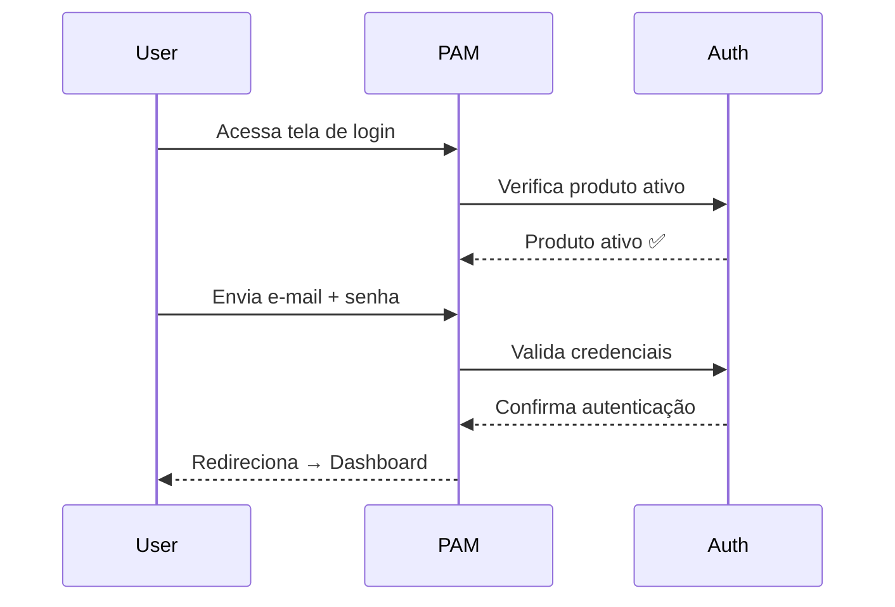

# 📘 PAM System — Documentação Upfront de Páginas

> **Sistema:** PAM (Product Access Management) — Gestão de Acesso e Pessoas  
> **Versão:** 1.0  
> **Data:** 01/06/2026  
> **Autenticação:** Single Sign-On corporativo  
> **Rede Docker:** `minha-rede-compartilhada`

---

## 🏗️ Arquitetura de Containers

| Container | Descrição |
|-----------|-----------|
| `web` | Aplicação principal (Uvicorn) |
| `worker` | Processamento de tarefas assíncronas |
| `mysql` | Banco de dados MySQL 8.0 |
| `redis` | Cache e filas |
| `smtp4dev` | Servidor SMTP de desenvolvimento |
| `auth_web` | Sistema de autenticação SSO |
| `auth_api` | API de autenticação |
| `auth_db` | Banco de dados de autenticação |
| `auth_redis` | Cache de autenticação |

### Inicialização

```bash
# 1. Subir sistema de autenticação primeiro (SSO)
cd profile && make up

# 2. Subir PAM
cd pam && make up

# 3. Verificar status
docker compose ps
```

---

## 🔐 Fluxo de Autenticação (SSO)



---

## 📑 Índice de Páginas

### 🔓 Páginas Públicas (sem autenticação)

| # | Página | URL | Descrição |
|---|--------|-----|-----------|
| 1 | Login | `/` | Tela de login com formulário email/senha |
| 2 | Esqueci Senha | `/forgot-password` | Solicitação de reset de senha |
| 3 | Redefinir Senha | `/reset-password?token=` | Formulário de nova senha |
| 4 | Senha Redefinida | `/reset-password-success` | Confirmação de reset |

### 📊 Páginas Principais (autenticado)

| # | Página | URL | Perfil | Descrição |
|---|--------|-----|--------|-----------|
| 5 | Dashboard | `/dashboard` | Todos | Visão geral com cards de estatísticas |
| 6 | Grupos | `/groups` | Todos | Lista de grupos de acesso |
| 7 | Pessoas do Grupo | `/groups/{id}/people` | Todos | Gerenciar membros de um grupo |
| 8 | Pessoas | `/people` | Todos | Lista de pessoas cadastradas |
| 9 | Projetos | `/projects` | Todos | Lista de projetos |
| 10 | Funções de Projeto | `/projects/roles` | Todos | Papeis/Funções ACC Industry |

### ⚙️ Configurações (admin+)

| # | Página | URL | Perfil | Descrição |
|---|--------|-----|--------|-----------|
| 11 | Domínios | `/domains` | Superadmin | Gerenciar domínios |
| 12 | Usuários | `/users` | Admin+ | Gerenciar usuários do domínio |
| 13 | Integrações | `/config/integrations` | Admin+ | Configurar integrações externas |
| 14 | Hubs | `/config/hubs` | Admin+ | Gerenciar hubs |
| 15 | Scheduler | `/config/scheduler` | Admin+ | Agendamento de tarefas |
| 16 | Importações | `/config/importacoes` | Admin+ | Monitor de importações |
| 17 | Status | `/config/status` | Admin+ | Status do sistema e filas |
| 18 | Logs | `/config/logs` | Admin+ | Logs do sistema |
| 19 | Project Groups | `/project-groups` | Todos | Grupos de projeto |

### 🔧 Páginas Especiais

| # | Página | URL | Descrição |
|---|--------|-----|-----------|
| 20 | Produto Inativo | `/product-not-active` | Bloqueio quando produto não está ativo |

---

## 📄 Detalhamento das Páginas

---

### 1. 🔑 Login (`/`)

**Arquivo:** `app/templates/auth/login.html`  
**Acesso:** Público  
**API chamadas:** `POST /api/auth/login`

**Descrição:**
Tela de login do PAM. Se o usuário já estiver autenticado (cookie JWT válido), redireciona automaticamente para `/dashboard`. A autenticação é delegada ao PROFILE via SSO.

**Componentes:**
- Campo de email
- Campo de senha com toggle de visibilidade
- Botão "Entrar"
- Link "Esqueceu sua senha?"
- Suporte a Turnstile (Cloudflare) se configurado
- Logo DUEGETEC + nome do app (PAM System)

**Fluxo:**
1. Usuário acessa a tela de login
2. Sistema verifica se produto está ativo no sistema de autenticação
3. Se produto ativo → mostra formulário de login
4. Se produto inativo → mostra aviso de bloqueio

---

### 2. 🔑 Esqueci Senha (`/forgot-password`)

**Arquivo:** `app/templates/auth/forgot-password.html`  
**Acesso:** Público

**Descrição:**
Formulário para solicitar link de recuperação de senha. Envia email com token de reset.

**Componentes:**
- Campo de email
- Botão "Enviar link de recuperação"
- Link para voltar ao login

---

### 3. 🔑 Redefinir Senha (`/reset-password?token=`)

**Arquivo:** `app/templates/auth/reset-password.html`  
**Acesso:** Público (com token válido)

**Descrição:**
Formulário para definir nova senha. O token é validado contra o banco (campo `reset_token` + expiração). Se inválido/expirado, mostra erro.

**Componentes:**
- Campo de nova senha
- Campo de confirmação de senha
- Validação de força de senha
- Token passado via query string

---

### 4. 🔑 Senha Redefinida com Sucesso (`/reset-password-success`)

**Arquivo:** `app/templates/auth/reset-password-success.html`  
**Acesso:** Público

**Descrição:**
Página de confirmação após reset de senha bem-sucedido. Contém link para voltar ao login.

---

### 5. 📊 Dashboard (`/dashboard`)

**Arquivo:** `app/templates/dashboard.html`  
**Acesso:** Autenticado (todos os perfis)  
**API chamadas:** `GET /api/people`, `GET /api/projects`, `GET /api/hubs`, `GET /api/groups`, `GET /api/redis/status`

**Descrição:**
Painel principal com visão geral do sistema. Exibe cards com contadores de Pessoas, Projetos, Hubs, Grupos e status das filas Redis.

**Componentes:**
- **Header:** "Painel · Visão Geral — Gestão de Acesso"
- **Cards de Estatísticas:**
  - 👥 Pessoas (total)
  - 📁 Projetos (total)
  - 📦 Hubs (total)
  - 👨‍👩‍👦 Grupos (total)
- **Status de Filas:** Filas Redis com contagem de tarefas pendentes
- **Sidebar:** Navegação completa (Dashboard, Grupos, Pessoas, Projetos, Configurações)
- **Seletor de Domínio:** Dropdown para filtrar por domínio (se multi-domínio)

**Regras de negócio:**
- Dados filtrados por domínio selecionado
- Superadmin vê todos os domínios
- Usuário comum vê apenas dados do seu domínio
- Se produto não estiver ativo → redireciona para `/product-not-active`

---

### 6. 👥 Grupos (`/groups`)

**Arquivo:** `app/templates/groups/list.html`  
**Acesso:** Autenticado (todos)  
**API chamadas:** `GET /api/groups`, `POST /api/groups`, `DELETE /api/groups/{id}`

**Descrição:**
Lista de grupos de acesso. Permite criar, visualizar e remover grupos. Cada grupo pode conter múltiplas pessoas.

**Componentes:**
- Tabela de grupos com colunas: Nome, Descrição, Qtd. Pessoas, Ações
- Botão "Novo Grupo" (modal de criação)
- Modal de criação: Nome, Descrição
- Ações: Editar, Excluir, Ver Pessoas
- Link para `/groups/{id}/people` (gerenciar membros)

**Perfis de acesso:**
- **Superadmin:** CRUD total
- **Admin:** CRUD no seu domínio
- **Usuário:** Apenas visualização

---

### 7. 👤 Pessoas do Grupo (`/groups/{group_id}/people`)

**Arquivo:** `app/templates/groups/people.html`  
**Acesso:** Autenticado (todos)  
**API chamadas:** `GET /api/groups/{id}/people`, `POST /api/groups/{id}/people`, `DELETE /api/groups/{id}/people/{person_id}`

**Descrição:**
Gerenciamento de membros de um grupo específico. Permite adicionar/remover pessoas do grupo.

**Componentes:**
- Nome do grupo no cabeçalho
- Tabela de membros: Nome, Email, Ações
- Botão "Adicionar Pessoa" (modal de busca/seleção)
- Breadcrumb: Grupos > Nome do Grupo

---

### 8. 👤 Pessoas (`/people`)

**Arquivo:** `app/templates/people/list.html`  
**Acesso:** Autenticado (todos)  
**API chamadas:** `GET /api/people`, `POST /api/people`, `PUT /api/people/{id}`, `DELETE /api/people/{id}`

**Descrição:**
Lista de pessoas cadastradas no sistema. Pessoas são entidades que podem ser associadas a grupos e projetos.

**Componentes:**
- Tabela de pessoas: Nome, Email, Grupos, Projetos, Ações
- Botão "Nova Pessoa" (modal)
- Modal de criação/edição: Nome, Email, Telefone, etc.
- Filtros e busca
- Ações: Editar, Excluir

---

### 9. 📁 Projetos (`/projects`)

**Arquivo:** `app/templates/projects/list.html`  
**Acesso:** Autenticado (todos)  
**API chamadas:** `GET /api/projects`, `POST /api/projects`, `PUT /api/projects/{id}`, `DELETE /api/projects/{id}`

**Descrição:**
Lista de projetos. Projetos representam entregas/contextos onde pessoas e grupos atuam.

**Componentes:**
- Tabela de projetos: Nome, Descrição, Status, Ações
- Botão "Novo Projeto" (modal)
- Modal: Nome, Descrição, Status
- Ações: Editar, Excluir

---

### 10. 🏭 Funções de Projeto (`/projects/roles`)

**Arquivo:** `app/templates/projects/roles.html`  
**Acesso:** Autenticado (todos)  
**API chamadas:** `GET /api/product_roles`, `POST /api/product_roles`, `DELETE /api/product_roles/{id}`

**Descrição:**
Gerenciamento de funções/papeis de projeto (ACC Industry Roles). Define os papeis que pessoas podem ter em projetos.

**Componentes:**
- Tabela de funções: Nome, Descrição, Ações
- Botão "Nova Função"
- Modal: Nome, Descrição

---

### 11. 🏢 Domínios (`/domains`)

**Arquivo:** `app/templates/domains/list.html`  
**Acesso:** ⚠️ **Apenas Superadmin**  
**API chamadas:** `GET /api/domains`, `POST /api/domains/sync-from-profile`

**Descrição:**
Gerenciamento de domínios. Domínios são as organizações/tenants do sistema, sincronizados a partir do PROFILE.

**Componentes:**
- Tabela de domínios: Nome, Slug, Status, Ações
- Botão "Sincronizar com PROFILE"
- Indicador de status da sincronização

**Regras:**
- Apenas superadmin pode acessar (outros perfis → redireciona ao dashboard)
- Domínios são originados do PROFILE (SSO)

---

### 12. 👥 Usuários (`/users`)

**Arquivo:** `app/templates/users/list.html`  
**Acesso:** Admin+ (admin em pelo menos um domínio)  
**API chamadas:** `GET /api/users`, `POST /api/users`, `PUT /api/users/{id}`, `DELETE /api/users/{id}`

**Descrição:**
Gerenciamento de usuários do sistema. Usuários são contas que acessam o PAM.

**Componentes:**
- Tabela de usuários: Nome, Email, Domínio, Perfil, Status, Ações
- Botão "Novo Usuário"
- Modal: Nome, Email, Senha, Domínio, Papeis
- Filtros por domínio

---

### 13. 🔌 Integrações (`/config/integrations`)

**Arquivo:** `app/templates/config/integrations.html`  
**Acesso:** Admin+  
**API chamadas:** `GET /api/integrations`, `POST /api/integrations`, `PUT /api/integrations/{id}`

**Descrição:**
Configuração de integrações com sistemas externos (ACC, Entra ID, Google, PROFILE).

**Componentes:**
- Cards/lista de integrações disponíveis
- Cada integração: Nome, Status (ativo/inativo), Configurações
- Toggle de ativação
- Campos de configuração específicos por integração

**Integrações suportadas:**
- **ACC Client:** Integração com ACC Delivery
- **Entra ID:** Azure AD / Microsoft Entra ID
- **Google:** Google Workspace
- **PROFILE:** Integração SSO nativa

---

### 14. 📦 Hubs (`/config/hubs`)

**Arquivo:** `app/templates/config/hubs.html`  
**Acesso:** Admin+  
**API chamadas:** `GET /api/hubs`, `POST /api/hubs`, `DELETE /api/hubs/{id}`

**Descrição:**
Gerenciamento de hubs — pontos centrais de distribuição/organização.

**Componentes:**
- Tabela de hubs: Nome, Descrição, Status, Ações
- Botão "Novo Hub"
- Modal: Nome, Descrição

---

### 15. ⏰ Scheduler (`/config/scheduler`)

**Arquivo:** `app/templates/config/scheduler.html`  
**Acesso:** Admin+  
**API chamadas:** `GET /api/scheduler`, `POST /api/scheduler`, `DELETE /api/scheduler/{id}`

**Descrição:**
Configuração de tarefas agendadas (scheduler). Permite criar jobs recorrentes para sincronização, importação etc.

**Componentes:**
- Tabela de agendamentos: Nome, Cron, Status, Última execução, Próxima, Ações
- Botão "Novo Agendamento"
- Modal: Nome, Expressão Cron, Tipo de tarefa, Parâmetros
- Status de cada job (sucesso/falha/pendente)
- Links para preview e validação

**Sub-páginas:**
- `/config/scheduler/preview/{link_id}` — Preview dry-run
- `/config/scheduler/fix/{link_id}` — Correção de links
- `/config/scheduler/validation/{link_id}` — Validação de links

---

### 16. 📥 Importações (`/config/importacoes`)

**Arquivo:** `app/templates/config/import_monitor.html`  
**Acesso:** Admin+  
**API chamadas:** `GET /api/import`, `POST /api/import`

**Descrição:**
Monitor de processamento de importações. Acompanha jobs de importação de dados em lote.

**Componentes:**
- Tabela de importações: Arquivo, Status, Progresso, Data, Ações
- Upload de arquivo para importação
- Barra de progresso
- Log de erros/avisos

---

### 17. 📈 Status (`/config/status`)

**Arquivo:** `app/templates/config/status.html`  
**Acesso:** Admin+  
**API chamadas:** `GET /api/status`, `GET /api/redis/status`

**Descrição:**
Página de status do sistema. Mostra saúde dos serviços, filas Redis, workers.

**Componentes:**
- Status dos containers/serviços
- Filas Redis com contagem
- Workers ativos
- Uptime
- Indicadores verde/amarelo/vermelho

---

### 18. 📋 Logs (`/config/logs`)

**Arquivo:** `app/templates/config/logs.html`  
**Acesso:** Admin+  
**API chamadas:** `GET /api/logs`

**Descrição:**
Visualização de logs do sistema. Permite filtrar e buscar eventos.

**Componentes:**
- Tabela de logs: Timestamp, Nível, Módulo, Mensagem
- Filtros: Nível (INFO, WARNING, ERROR), Data, Módulo
- Busca textual
- Paginação

---

### 19. 📁 Project Groups (`/project-groups`)

**Arquivo:** `app/templates/project_groups/list.html`  
**Acesso:** Autenticado (todos)  
**API chamadas:** `GET /api/project_groups`, `POST /api/project_groups`, `DELETE /api/project_groups/{id}`

**Descrição:**
Associação entre projetos e grupos. Define quais grupos têm acesso a quais projetos.

**Componentes:**
- Tabela: Projeto, Grupo, Ações
- Botão "Nova Associação"
- Modal: Selecionar Projeto + Selecionar Grupo

---

### 20. 🚫 Produto Inativo (`/product-not-active`)

**Arquivo:** `app/templates/product_not_active.html`  
**Acesso:** Autenticado (quando produto está inativo)

**Descrição:**
Página de bloqueio exibida quando o produto PAM não está ativo no PROFILE. Usuário autenticado mas sem acesso ao produto.

**Componentes:**
- Mensagem de produto inativo
- Motivo do bloqueio
- Contato do administrador

---

## 🔐 Matriz de Permissões

| Página | Superadmin | Admin | Usuário |
|--------|:----------:|:-----:|:-------:|
| Dashboard | ✅ | ✅ | ✅ |
| Grupos | ✅ | ✅ | ✅ |
| Pessoas do Grupo | ✅ | ✅ | ✅ |
| Pessoas | ✅ | ✅ | ✅ |
| Projetos | ✅ | ✅ | ✅ |
| Funções de Projeto | ✅ | ✅ | ✅ |
| Project Groups | ✅ | ✅ | ✅ |
| Domínios | ✅ | ❌ | ❌ |
| Usuários | ✅ | ✅ | ❌ |
| Integrações | ✅ | ✅ | ❌ |
| Hubs | ✅ | ✅ | ❌ |
| Scheduler | ✅ | ✅ | ❌ |
| Importações | ✅ | ✅ | ❌ |
| Status | ✅ | ✅ | ❌ |
| Logs | ✅ | ✅ | ❌ |

---

## 🧩 Componentes Compartilhados

### Sidebar (`layout/`)
- Logo DUEGETEC + nome do app
- Links de navegação com ícones Font Awesome
- Indicador de página ativa (highlight azul)
- Seção "Configurações" recolhível
- Menu do usuário no rodapé (email, perfil, sair)

### Header
- Breadcrumb com página atual
- Título e descrição da página
- Seletor de domínio (dropdown)

### Modais
- Criar/Editar entidade
- Confirmar exclusão
- Buscar/Selecionar pessoa

### Tabelas
- Colunas ordenáveis
- Paginação
- Busca/filtro
- Ações por linha (editar, excluir)

---

## 📊 APIs por Página

| Página | APIs Chamadas |
|--------|---------------|
| Login | `POST /api/auth/login` |
| Dashboard | `GET /api/people`, `/api/projects`, `/api/hubs`, `/api/groups`, `/api/redis/status` |
| Grupos | `GET/POST /api/groups`, `DELETE /api/groups/{id}` |
| Pessoas do Grupo | `GET /api/groups/{id}/people`, `POST/DELETE` |
| Pessoas | `GET/POST /api/people`, `PUT/DELETE /api/people/{id}` |
| Projetos | `GET/POST /api/projects`, `PUT/DELETE /api/projects/{id}` |
| Funções | `GET/POST /api/product_roles`, `DELETE` |
| Domínios | `GET /api/domains`, `POST /api/domains/sync-from-profile` |
| Usuários | `GET/POST /api/users`, `PUT/DELETE /api/users/{id}` |
| Integrações | `GET/POST /api/integrations`, `PUT` |
| Hubs | `GET/POST /api/hubs`, `DELETE` |
| Scheduler | `GET/POST /api/scheduler`, `DELETE` |
| Importações | `GET /api/import`, `POST` |
| Status | `GET /api/status`, `GET /api/redis/status` |
| Logs | `GET /api/logs` |
| Project Groups | `GET/POST /api/project_groups`, `DELETE` |

---

## 🖼️ Capturas de Tela

As capturas de tela automatizadas são geradas pelo sistema **passoapasso** e armazenadas em `output/{session_id}/`.

### Comando para gerar capturas:

```bash
# Iniciar captura automática
curl -X POST "http://localhost:8000/start?url=http://localhost:8005/&auto=true"

# Iniciar captura manual (cliques do usuário)
curl -X POST "http://localhost:8000/start?url=http://localhost:8005/&auto=false"
```

---

> **Próximo passo:** Melhorar as capturas de tela com recursos inspirados no Dubble: anotações visuais aprimoradas, numeração sequencial, descrições textuais e geração de guias passo a passo.
